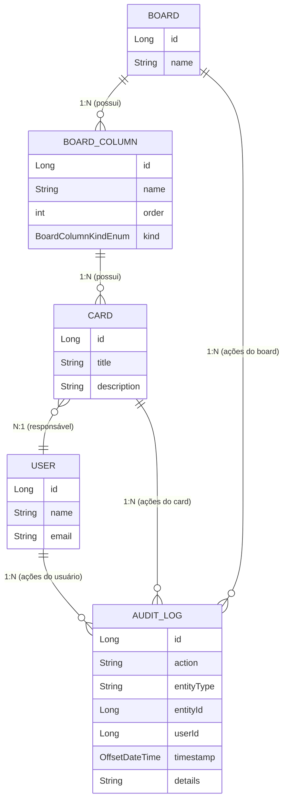

# Board de Tarefas - Desafio Santander Bootcamp DIO 2025

Este projeto é um gerenciador de boards de tarefas, desenvolvido como parte do desafio final do módulo do Santander Bootcamp DIO 2025. O ponto de partida foi o projeto base fornecido pelo professor do curso, que já implementava as funcionalidades essenciais de um board Kanban. A partir desse projeto, foram propostas melhorias e novas funcionalidades, detalhadas abaixo.

## Contexto do Projeto

O sistema permite a criação e gerenciamento de boards, colunas e cards, além de funcionalidades de histórico e atribuição de responsáveis. O backend é desenvolvido em Java, utilizando JDBC para persistência em banco de dados MySQL. O controle de versionamento do banco é feito via Liquibase.

### Funcionalidades Originais (Projeto Base)
- Criação de boards com múltiplas colunas
- Criação, movimentação e cancelamento de cards
- Visualização de boards, colunas e cards

### Melhorias Implementadas
- **Histórico de movimentações**: agora é possível visualizar o histórico de ações de cada card e board, incluindo movimentações, bloqueios, desbloqueios, cancelamentos e atribuições de usuário.
- **Atribuição de responsável ao card**: cards podem ter um usuário responsável, que pode ser alterado ou removido.
- **Listagem e gerenciamento de usuários**: é possível listar usuários cadastrados e atribuí-los aos cards.

## Estrutura de Dados

O sistema utiliza as seguintes entidades principais e seus relacionamentos:



- **Relacionamentos**:
  - Um board possui várias colunas (um-para-muitos)
  - Uma coluna possui vários cards (um-para-muitos)
  - Um card pode ter um usuário responsável (muitos-para-um)
  - Cards, boards e usuários geram registros de histórico (audit log)

## Banco de Dados

- **Banco**: MySQL (recomendado usar o MySQL Workbench para administração)
- **Configuração padrão** (arquivo `liquibase.properties`):
  - URL: `jdbc:mysql://localhost:3306/board`
  - Usuário: `root`
  - Senha: 
  - Driver: `com.mysql.cj.jdbc.Driver`


### Sobre os Usuários

> **Atenção:** Os usuários do sistema são inseridos de forma *mocada* diretamente via script SQL (INSERT), pois o sistema não possui tela/menu para cadastro de usuários. Caso você queira usar seus próprios usuários, basta editar o script de insert de usuários (veja os arquivos de migration SQL) e inserir os dados desejados.

> **Melhoria futura sugerida:** implementar o cadastro de usuários diretamente pelo menu interativo do sistema, tornando o fluxo mais completo e flexível.

Você pode alterar o usuário, senha e porta conforme sua configuração local.

## Como rodar o projeto

1. **Clone o repositório:**
   ```sh
   git clone <url-do-repo>
   ```
2. **Configure o banco de dados MySQL:**
   - Crie um banco chamado `board`.
   - Ajuste o arquivo `src/main/resources/liquibase.properties` se necessário.
3. **Execute as migrations:**
   - Rode o Liquibase ou execute o projeto para criar as tabelas automaticamente.
4. **Compile e execute o projeto:**
   ```sh
   ./gradlew build
   ./gradlew run
   ```

## Observações Finais

Este projeto foi desenvolvido para fins acadêmicos, como parte do desafio do Santander Bootcamp DIO 2025. Sinta-se à vontade para contribuir, sugerir melhorias ou adaptar para seus estudos!
